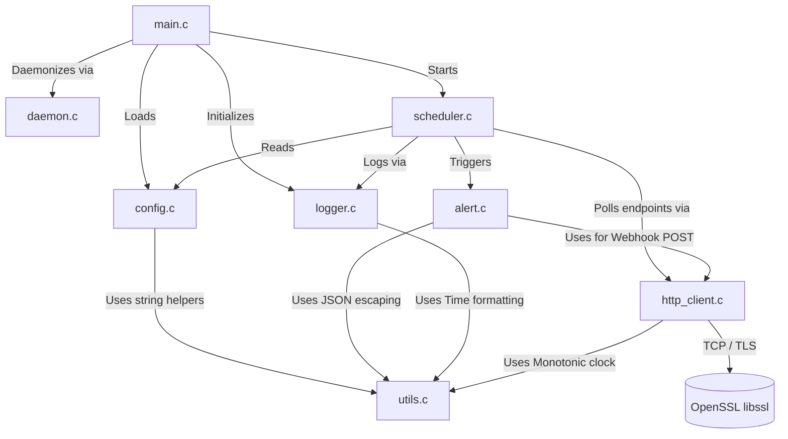

# SENTINEL-D Architecture

SENTINEL-D is designed as a modular, pure-C implementation. To avoid unnecessary complexity, it breaks the core logic into discrete modules, each with a narrow, single responsibility.

## Module Diagram

## Module Responsibilities

### `main.c`
The orchestrator. It parses CLI arguments using `getopt`, loads configuration, optionally triggers daemonization, initializes the logging sink, and then blocks on `scheduler_run()`. It ensures clean teardown of heap allocations (like config strings) upon exit.

### `config.c` / `config.h`
Implements a simple `KEY=value` parser, ignoring comments and whitespace. It aggregates file configuration with `getenv()` overrides. The config struct `SentinelConfig` acts as the read-only source of truth passed down to the scheduler and alert engines.

### `daemon.c` / `daemon.h`
Encapsulates POSIX semantics for fully detaching from the controlling terminal. It performs a double `fork()`, creates a new session via `setsid()`, masks file permissions, shifts the working directory to `/`, and redirects standard file descriptors to `/dev/null`. It also manages the writing and validation of the PID file, catching stale PIDs using `kill(pid, 0)`.

### `scheduler.c` / `scheduler.h`
The state machine. It loops infinitely (interrupted by `nanosleep`), stepping through every configured endpoint.
It tracks the historical state of each endpoint (`consecutive_failures`, `is_alerting`, `last_alert_time`) to enforce:
1. **Failure Thresholds**: Suppressing noise until $N$ consecutive failures occur.
2. **Cooldowns**: Enforcing a strict silence period between repeat failure alerts.
3. **Recovery**: Detecting the transition from `unhealthy -> healthy` and triggering a green recovery alert.

It binds `SIGTERM` and `SIGINT` to softly break the poll loop instead of instantly dying, enabling a final aggregate log summary to be written.

### `http_client.c` / `http_client.h`
The networking engine. For plain HTTP, it uses raw POSIX TCP sockets, setting `SO_RCVTIMEO` & `SO_SNDTIMEO` deadlines to prevent stalling. For HTTPS, it bridges to the system OpenSSL library, completing TLS handshakes while obeying the same timeout guarantees. It does not ingest the full HTTP body; it merely extracts and parses the initial HTTP/1.x Status Line (e.g. `HTTP/1.1 200 OK`) to save memory and CPU cycles.

### `alert.c` / `alert.h`
The formatter block. Its core function, `alert_build_payload`, is completely pure (no side effects) and can be fully unit tested. It safely escapes strings against JSON injection and constructs a Discord Webhook Embedded structure. It exposes top-level `alert_send` and `alert_send_recovery` which invoke securely over TLS to POST to Discord.

### `logger.c` / `logger.h`
Thread-safe formatted output stream wrapper. Applies an `ISO-8601` UTC timestamp to every line, supporting basic log-level gates (`DEBUG`, `INFO`, `WARN`, `ERROR`). Redacts the Discord Webhook from standard configuration dumps to prevent credential leaks.

### `utils.c` / `utils.h`
Stateless string-manipulation routines, timer primitives (monotonic/wall clocks), and JSON-encoding sweeps.

## Testing Strategy
The architecture isolates complex or risky behavior (Parsing, String manipulation, JSON payload generation) away from State/Network modules.

Three test suites are provided to validate these "pure functions" without needing active network connections:
- `test_config.c` (Validates robust ingestion of edge-case conf layouts)
- `test_utils.c` (Validates bounds-checking on string slices and monotonic timer validity)
- `test_alert_payload.c` (Ensures that pathological Service Names or Error messages do not corrupt the JSON structure).
